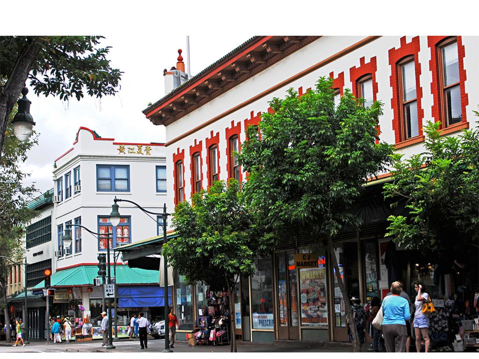

## Welcome to Joelle Byars' Final Project - "Chinatown"

We got matching tattoos of a tortoise he drew crudely the night before while stoned on the couch. Left ass cheek. Same side as the heart.

“What should we name it?” he asked me.

“I don’t know. Something stupid.” I’ve always been terrible at naming things, another great reason to never have kids, as if the long line of mental illness and eczema wasn’t enough to persuade me.

“What about ‘Eggplant’?”

“Eggplant.” I was in disbelief that he was actually worse at naming things than I was, looks like he would be just as terrible of a father as I would be a mother. “Are you serious? That’s what you want to name it? Not even something dumb like Maxamillion or Reginald? Eggplant?”

“Yeah, Eggplant.” His lips were thin and straight, his eyes bloodshot and looking straight into mine. He meant it. I lost my mind and couldn’t stop laughing.

“I promise you, if you actually name that stupid thing ‘Eggplant’ I will tattoo it on my ass tomorrow.”

“You’ve got yourself a deal. Say hello to Eggplant.” He made it official by attempting to calligraph the word in elegant swirls under the misshapen shell and stumped legs of the tortoise. As the pièce de résistance he gave it a monocle and top hat. “If you’re getting this on you forever, you deserve a little class.”

I may be an idiot, but I am a woman of my word. The following day after staying up all night watching shitty stoner comedies—my favorite by far being Half Baked because who can resist Dave Chappelle?—we got up and went to Chinatown to find someone accepting walk-ins. 

Most tattoo artists in Honolulu all look the same. Of course covered in tattoos, but they are all skinny and dressed like SoCal 90s skaters. So when a rotund man in his sixties wearing acid wash overalls and a Dancing Bear tie-dye t-shirt said he was available in a shop covered in skulls and disinfectant, I knew I found my man.

He stuck his hand out to me, “My name is Darryl. Nice to meet you.” His hands were thick and meaty, like brats sewn onto a boxing glove. I was worried he was going to do the thing that most big guys do when they shake a woman’s hand, go limp and let me accidentally crush their fingers together. I was pleasantly surprised when he gave me an appropriate, solid handshake. A true gentleman.

“Nice to meet you, I’m Genie and this is Spencer.” I pointed at Spencer with my left thumb. I let go of Darryl’s hand and motioned to Spencer to give me the crumpled sheet of paper in his pocket. He timidly handed it to me, still expecting me to back out. “I was hoping to get this on my ass. Would you be willing to do that?”

Darryl smoothed out the paper and immediately started laughing. “Are you sure?”

“Oh yeah.”

Spencer leaned in and whispered, “You know you don’t have to do this, right?”

“Sure I do, we made a deal. You could have named him something else, but here we are.”

“Fuck it. Darryl, do you have enough time to do both of us?”

“Sure thing, come on back.”

Spencer had sleeves already when I met him at O’Toole’s two years prior, but I didn’t have any tattoos yet. When I was younger I always thought they needed to be special, something that you hold close to your heart or that you can never regret. Something that resembles what makes you who you are. But there I was, getting my first tattoo of a lopsided classy turtle with “Eggplant” in Victorian script underneath. 

It felt right.

He made everything feel right. Even having a strange, large man singing “Electric Feel” pull on my ass while doing something that I could only describe as holding a dull flame to it. Anyone who says tattoos don’t hurt all that bad is full of shit. Even still, every time I hear MGMT I can feel the needles in my skin.

But Spencer made it okay. And later, when we were both leaning to the right on the couch after sharing a blunt so big only he could roll it, he played me “Sex and Candy” on the ukulele. It wasn’t long until we forgot about our sore asses and tangled ourselves in one another. I pulled his hips to bring him closer and he cradled my neck. He always did the same thing when I got undressed for him. He’d take half a step back and look at me before kissing me and bringing his lips up to my ear to whisper, “I love you.”

I got up the next morning and went back to the Beachcomber ready to stand behind the front desk with my floral print shirt that was too baggy on my chest so it could fit my shoulders and my bun pulled back so tight I could feel my hair when I breathed. I always hated my bullshit accent saying “Aloha” and “Mahalo.”

Spencer taught stand-up paddle boarding lessons and was too busy shouting vague lines of encouragement to feel like a fraud. When I was pointing out the jug of complimentary strawberry-cucumber water to eager families in matching outfits, he was out in the water. Asshole. 

As per usual, I got off work with only enough time to grab a musubi, run home, and change before going to Top of Waikiki and pretend like I wasn’t ripping off people with our Wine Special of the Day. 

“No, no,” I’d tell them. “This rosé is excellent, but we like to give our guests the opportunity to try new wines. Yes, that’s correct. Only six dollars a glass.” I never told them that they could buy a bottle of the same wine at an ABC Store for only five bucks instead. I justified it to myself with the idea that the people who were eating there could afford a lie and overpriced food. Besides, the higher the tab the bigger my tip.

That was our life for a while. Him keeping his tan perfect and me switching between Top of Waikiki and Lulu’s every night except Mondays. I’d get home and he would have something vegetarian for dinner because I could never convince him to eat meat, but he loved ice cream too much to give up dairy. We could only get the cheap ones, whatever was on sale from Foodland or Safeway. But after dinner we’d smoke a blunt and I’d put my legs over his and we would share a bowl of ice cream while watching a shitty stoner comedy. Some nights we would play cards while we watched, rotating between gin and poker—if we played poker he won, if we played gin I did. If it was too hot out and the Trades refused to come through the jalousies—because apparently it’s illegal to have a/c in the tropics—then we would sit on opposite sides of the couch in our underwear and set the bowl in between us.

It was perfect.

I sometimes look back and wonder what happened. I never stopped loving him and I don’t think he stopped loving me either. I guess we were both too young and didn’t know ourselves or what we wanted enough to fight for those perfect nights.

It wasn’t anyone’s fault. No one cheated. No abuse. No stupid misunderstanding to look back and regret. Right guy, wrong time. He wanted the rest of his twenties to pass like that. Sitting on the same couch, watching Cheech and Chong, surfing every morning and paddle boarding in the afternoons to supplement whatever bills my three jobs didn’t cover. I wanted something else but I didn’t know what. Eventually, it was a mutual understanding that things weren’t going to be the same and we didn’t have a way to fix it. I thought about going back home to Washington, but I never did. He just moved in with a friend and I kept the apartment since it was in my name.

I grew up with the saying, “You gotta get under somebody to get over somebody.” I wanted to do that with Spencer, just to fill that empty spot on the couch for a moment. I needed something but I needed someone different from him. I met a girl named Rachel at The Dragon Upstairs down the street from O’Toole’s.

I never sang karaoke outside of Europe, but I liked to watch other people do it. Rachel got up and sang the night I met her. I was drawn to her for a reason I couldn’t understand so I bought her a Moscow Mule and asked her what her favorite song was.

“Hmm, my favorite song is probably ‘Love is Free’ by Sheryl Crow.”

“What’s your second favorite?”

“‘Got Your Money’ by ODB.”

Rachel was more petite than me, which was saying something since I’d always been small. Paddling made my arms and shoulders big, like everyone else on island, but otherwise I was still a small in everything I bought. I was shocked when she kissed me, but I was happy to go with it. I didn’t expect her to move in a month later or stay with me for the past year.

I was happy to go with that too.

Spencer texted me this morning when I was getting ready to go to work in that same ugly shirt that he saw me put on a thousand times. Amanda was still asleep in bed and my mind flashed to all the times she traced the lines of my tattoo and begged me to get it lasered off. I never told her that every time she touched it I could still feel his hands on me and I missed it.

